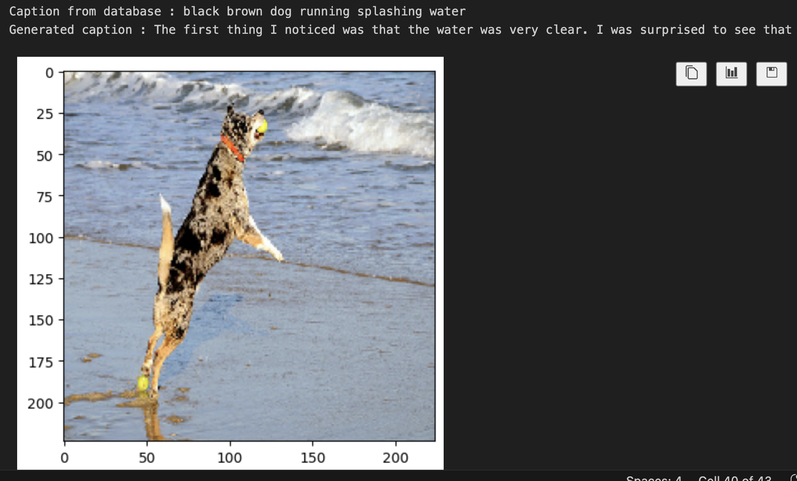

# Image captioning

## Setup

1. Get the dataset from Kaggle, https://www.kaggle.com/datasets/adityajn105/flickr8k 
2. Create a directory `archive/` 
3. Move the dataset to that directory

## Tensorflow for Mac Arm

If using mac os with m1 or m2 chip, follow the instructions to get ternsorflow https://developer.apple.com/metal/tensorflow-plugin/

## Appraoch used:
1. Object Detection with ImageNet + GPT-2:
 - I utilized ImageNet to identify objects within images.
 - Leveraging GPT-2 Small from Hugging Face, I generated descriptive sentences based on the detected objects.

2. Cosine Similarity for Image Retrieval:
 - I computed cosine similarity between a given image and items from the database.
 - By finding the closest image label, I was able to generate corresponding descriptive sentences.

